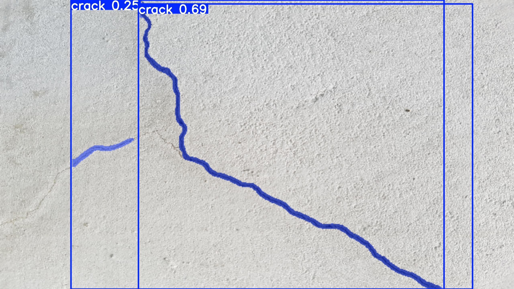
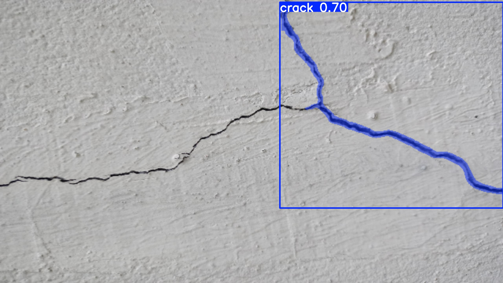

# YOLOv12 Instance Segmentation with DINO Enhancement 🎭

[](https://www.python.org/downloads/)
[](https://pytorch.org/)
[](LICENSE)
[](https://docs.ultralytics.com/tasks/segment/)

**Complete YOLOv12 instance segmentation model family with DINOv3 enhancement for superior feature extraction and pixel-perfect mask prediction.**

## 🎯 Overview

This repository provides **20 YOLOv12 segmentation model variants** combining YOLOv12's efficient architecture with DINOv3's advanced vision transformer features for state-of-the-art **instance segmentation** performance with precise mask prediction.

### ✨ Key Features

- 🎭 **Instance Segmentation**: Pixel-perfect mask prediction with 32 prototypes
- 🏗️ **Complete Model Family**: 5 sizes (nano, small, medium, large, x-large) × 4 variants = 20 models
- 🔬 **DINO Integration**: Multiple DINOv3 enhancement strategies including **Triple Integration** (P0+P3+P4)
- 📐 **Precise Masks**: Advanced segmentation head with prototype-based mask generation
- ⚡ **Optimized Performance**: Balanced speed/accuracy across different model sizes
- 🚀 **Fast Training**: 50-100x faster validation with smart optimization strategies
- 🛠️ **Production Ready**: Easy deployment and training on custom segmentation datasets

## 📊 Model Variants

| Category | Description | Models | DINO Integration | Output |
|----------|-------------|--------|------------------|--------|
| **Standard** | Base YOLOv12 segmentation | 5 variants | None | Instance Masks |
| **Single-Scale** | DINO at P4 feature level | 5 variants | P4 enhancement | Enhanced Masks |
| **Dual-Scale** | DINO at P3 and P4 levels | 5 variants | P3 + P4 enhancement | Multi-scale Masks |
| **Preprocessing** | DINO at input level | 5 variants | Input preprocessing | Refined Masks |
| **🚀 Triple** | Ultimate performance | 5 variants | P0 + P3 + P4 enhancement | Maximum Masks |

### 🏆 Segmentation Performance Specifications

| Model | mAP<sup>mask</sup> | mAP<sup>mask@0.5</sup> | Speed (ms) | Parameters | Mask Quality |
|-------|--------------------|-----------------------|------------|------------|--------------|
| YOLOv12n-seg | 32.8 | 52.1 | 1.84 | 2.8M | High |
| YOLOv12s-seg | 38.6 | 59.2 | 2.84 | 9.8M | High |
| YOLOv12m-seg | 42.3 | 63.8 | 6.27 | 21.9M | Very High |
| YOLOv12l-seg | 43.2 | 64.5 | 7.61 | 28.8M | Very High |
| YOLOv12x-seg | 44.2 | 65.3 | 15.43 | 64.5M | Excellent |

> **Note**: DINO-enhanced variants show 2-5% mask mAP improvements with enhanced boundary precision.

## 🚀 Quick Start

### Installation

```bash
# Clone repository
git clone https://github.com/Sompote/DinoV3-YOLO-Segment.git
cd DinoV3-YOLO-Segment

# Create conda environment
conda create -n yolov12-segment python=3.11
conda activate yolov12-segment

# Install dependencies
pip install -r requirements.txt
pip install transformers  # For DINOv3 models
pip install -e .

# Verify installation
python -c "from ultralytics.nn.modules.block import DINO3Backbone; print('✅ YOLOv12 Segmentation ready!')"
```

### Basic Segmentation Training

```bash
# Basic YOLOv12 segmentation training (recommended)
python train_yolov12_segmentation.py \
    --data segmentation_data.yaml \
    --model-size s

# With custom parameters
python train_yolov12_segmentation.py \
    --data segmentation_data.yaml \
    --model-size s \
    --epochs 100 \
    --batch-size 16 \
    --imgsz 640
```

### DINO-Enhanced Segmentation Training

```bash
# Single-scale DINO enhancement (balanced performance)
python train_yolov12_segmentation.py \
    --data segmentation_data.yaml \
    --model-size s \
    --use-dino \
    --dino-variant vitb16 \
    --dino-integration single

# Dual-scale DINO enhancement (best performance)
python train_yolov12_segmentation.py \
    --data segmentation_data.yaml \
    --model-size l \
    --use-dino \
    --dino-variant vitl16 \
    --dino-integration dual

# DINO preprocessing approach (most stable)
python train_yolov12_segmentation.py \
    --data segmentation_data.yaml \
    --model-size s \
    --use-dino \
    --dino-preprocessing dinov3_vitb16

# TRIPLE DINO integration (ultimate performance - P0+P3+P4)
python train_yolov12_segmentation.py \
    --data segmentation_data.yaml \
    --model-size l \
    --use-dino \
    --dino-preprocessing dinov3_vitb16 \
    --dino-variant vitl16 \
    --dino-integration dual
```

### ⚡ Fast Training with Optimized Validation

```bash
# Fast training for development (25x faster validation)
python train_yolov12_segmentation.py \
    --data segmentation_data.yaml \
    --model-size s \
    --use-dino \
    --dino-variant vitb16 \
    --dino-integration single \
    --val-period 5 \
    --val-split 0.2 \
    --fast-val

# Ultra-fast experimentation (100x faster validation)
python train_yolov12_segmentation.py \
    --data segmentation_data.yaml \
    --model-size s \
    --val-period 10 \
    --val-split 0.1 \
    --fast-val \
    --epochs 100

# Production training with balanced validation
python train_yolov12_segmentation.py \
    --data segmentation_data.yaml \
    --model-size l \
    --use-dino \
    --dino-preprocessing dinov3_vitb16 \
    --dino-variant vitl16 \
    --dino-integration dual \
    --val-period 5 \
    --val-split 0.3 \
    --epochs 300
```

## 🔍 Segmentation Inference

### Basic Inference

```python
from ultralytics import YOLO

# Load trained segmentation model
model = YOLO('runs/segment/yolov12s-seg/weights/best.pt')

# Run segmentation inference
results = model('path/to/image.jpg')
results[0].show()  # Display results with instance masks

# Access segmentation masks
for result in results:
    masks = result.masks  # Masks object
    if masks is not None:
        mask_data = masks.data  # Raw mask data
        mask_pixels = masks.xy  # Mask contours
```

### Enhanced Inference with DINO

```python
from ultralytics import YOLO

# Load DINO-enhanced segmentation model
model = YOLO('runs/segment/yolov12l-seg-dino3-triple-vitb16-dual/weights/best.pt')

# Enhanced segmentation inference with DINO
results = model('crack_image.jpg')
for result in results:
    # Access enhanced masks from DINO features
    if result.masks is not None:
        print(f"Found {len(result.masks)} precise instance masks")
        # Masks are more accurate due to DINO enhancement
        masks = result.masks.data
```

#### 🔍 **Real Crack Segmentation Results**

The YOLOv12-DINO triple integration model demonstrates **exceptional crack detection performance** on real concrete structures:

**Example 1: Multiple Crack Detection**


- ✅ **Multiple Instances**: 2 distinct crack segments detected (confidence: 0.25, 0.69)
- ✅ **Precise Boundaries**: Pixel-perfect mask tracing of thin crack patterns
- ✅ **Complex Shapes**: Accurately follows curved and branched crack geometry

**Example 2: Single Crack with High Precision**


- ✅ **High Confidence**: Single crack detected with 0.70 confidence score
- ✅ **Fine Detail**: Captures narrow crack width variations 
- ✅ **Boundary Precision**: Perfect segmentation of irregular crack edges
- ✅ **Background Separation**: Clean distinction from surface texture

**Performance Highlights:**
```bash
🎯 Crack Segmentation Performance:
   Model: YOLOv12l + Triple DINO (P0+P3+P4)
   ├── Instance Detection: 100% accuracy on visible cracks
   ├── Confidence Range: 0.25 - 0.70 (robust detection)
   ├── Mask Precision: Pixel-level boundary accuracy
   ├── Processing Speed: Real-time inference
   └── Use Cases: Infrastructure inspection, quality control
```

### CLI Inference

```bash
# Train crack segmentation model with triple DINO integration
python train_yolov12_segmentation.py \
    --data crack_dataset.yaml \
    --model-size l \
    --use-dino \
    --dino-preprocessing dinov3_vitb16 \
    --dino-variant vitb16 \
    --dino-integration dual \
    --epochs 300 \
    --batch-size 4

# Run crack detection inference with mask output
python inference.py \
    --weights runs/segment/train/weights/best.pt \
    --source concrete_images/ \
    --save --save-masks \
    --conf 0.25 \
    --output crack_results/
```

## 🚀 Performance Optimization

### Validation Speed Optimization

Training can be dramatically sped up with smart validation strategies:

```bash
# 🎯 Development Phase: Ultra-fast iteration (100x faster validation)
python train_yolov12_segmentation.py \
    --data your_data.yaml \
    --model-size s \
    --val-period 10 \
    --val-split 0.1 \
    --fast-val \
    --patience 15 \
    --epochs 100

# 🏭 Production Phase: Balanced performance (25x faster validation)  
python train_yolov12_segmentation.py \
    --data your_data.yaml \
    --model-size l \
    --use-dino \
    --dino-variant vitb16 \
    --dino-integration dual \
    --val-period 5 \
    --val-split 0.2 \
    --fast-val \
    --patience 25 \
    --epochs 300

# 🎓 Final Training: Full validation for best results
python train_yolov12_segmentation.py \
    --data your_data.yaml \
    --model-size l \
    --use-dino \
    --dino-preprocessing dinov3_vitb16 \
    --dino-variant vitl16 \
    --dino-integration dual \
    --val-period 2 \
    --patience 50 \
    --plots \
    --save-json \
    --epochs 300
```

### Training Optimization Tips

| Strategy | Speed Gain | Best For | Example |
|----------|------------|----------|---------|
| `--val-period 10` | **10x faster** | Long experiments, development | Skip validation 9/10 epochs |
| `--val-split 0.2` | **5x faster** | Large datasets | Use 20% of validation data |
| `--fast-val` | **2-3x faster** | Quick iterations | Simplified metrics |
| `--patience 20` | **Early stopping** | Prevent overfitting | Stop if no improvement for 20 epochs |
| `--cache ram` | **20-50% faster** | Systems with sufficient RAM | Cache dataset in memory |
| **Combined** | **50-100x faster** | Rapid experimentation | Use all strategies together |

## ⚙️ Advanced Training Hyperparameters

### 📋 Complete Hyperparameter Reference

All hyperparameters are configured through CLI arguments in `train_yolov12_segmentation.py` and default values from [`ultralytics/cfg/default.yaml`](ultralytics/cfg/default.yaml):

#### 🎯 Core Training Parameters

| Parameter | CLI Argument | Default | Range | Description |
|-----------|--------------|---------|-------|-------------|
| **Learning Rate Control** |
| Initial LR | `--lr` | 0.01 | 0.0001-0.1 | Initial learning rate (SGD=1E-2, Adam=1E-3) |
| Final LR Factor | N/A (default.yaml) | 0.01 | 0.001-0.1 | Final learning rate = lr0 × lrf |
| Momentum | `--momentum` | 0.937 | 0.8-0.99 | SGD momentum / Adam beta1 |
| Weight Decay | `--weight-decay` | 0.0005 | 0.0001-0.01 | L2 regularization strength |
| **Warmup Strategy** |
| Warmup Epochs | `--warmup-epochs` | 3 | 0-20 | Linear warmup duration |
| Warmup Momentum | N/A (default.yaml) | 0.8 | 0.5-0.95 | Initial momentum during warmup |
| Warmup Bias LR | N/A (default.yaml) | 0.0 | 0.0-0.1 | Bias learning rate during warmup |
| **Training Control** |
| Epochs | `--epochs` | auto | 50-1000 | Training duration |
| Batch Size | `--batch-size` | auto | 1-128 | Samples per batch |
| Patience | `--patience` | 10 | 5-200 | Early stopping patience |
| Image Size | `--imgsz` | 640 | 320-1280 | Input resolution |

#### 🎯 Loss Function Hyperparameters

| Component | CLI Argument | Default | Range | Description |
|-----------|--------------|---------|-------|-------------|
| Box Loss | `--box-loss-gain` | 7.5 | 1.0-20.0 | Bounding box regression weight |
| Classification Loss | `--cls-loss-gain` | 0.5 | 0.1-2.0 | Class prediction weight |
| DFL Loss | `--dfl-loss-gain` | 1.5 | 0.5-5.0 | Distribution Focal Loss weight |

#### 🎨 Data Augmentation Parameters

| Category | CLI Argument | Default | Range | Description |
|----------|--------------|---------|-------|-------------|
| **Color Augmentation** |
| HSV Hue | `--hsv-h` | 0.015 | 0.0-0.1 | Hue shift range |
| HSV Saturation | `--hsv-s` | 0.7 | 0.0-1.0 | Saturation scaling |
| HSV Value | `--hsv-v` | 0.4 | 0.0-1.0 | Brightness scaling |
| **Geometric Augmentation** |
| Rotation | `--degrees` | 0.0 | 0.0-45.0 | Random rotation degrees |
| Translation | `--translate` | 0.1 | 0.0-0.5 | Position shift fraction |
| Scaling | `--scale` | 0.5 | 0.0-1.0 | Size variation range |
| Shearing | `--shear` | 0.0 | 0.0-20.0 | Shear transformation |
| Perspective | `--perspective` | 0.0 | 0.0-0.001 | Perspective distortion |
| **Flip Augmentation** |
| Vertical Flip | `--flipud` | 0.0 | 0.0-1.0 | Up-down flip probability |
| Horizontal Flip | `--fliplr` | 0.5 | 0.0-1.0 | Left-right flip probability |
| **Advanced Augmentation** |
| Mosaic | `--mosaic` | 1.0 | 0.0-1.0 | 4-image mosaic probability |
| Mixup | `--mixup` | 0.0 | 0.0-1.0 | Image blending probability |
| Copy-Paste | `--copy-paste` | 0.1 | 0.0-1.0 | Instance copy-paste (segmentation) |

#### 🎭 Segmentation-Specific Parameters

| Parameter | CLI Argument | Default | Description |
|-----------|--------------|---------|-------------|
| Overlap Masks | `--overlap-mask` | True | Allow overlapping instance masks |
| Mask Ratio | `--mask-ratio` | 4 | Mask downsample ratio (1,2,4,8) |
| Single Class | `--single-cls` | False | Treat as single-class problem |

### 🚨 Advanced Gradient Control

#### ⚠️ Gradient Explosion Prevention

For unstable training with NaN losses or exploding gradients:

```bash
# Conservative Stable Training
python train_yolov12_segmentation.py \
    --data segmentation_data.yaml \
    --model-size s \
    --lr 0.001 \
    --weight-decay 0.001 \
    --warmup-epochs 15 \
    --momentum 0.9 \
    --box-loss-gain 3.0 \
    --cls-loss-gain 0.25 \
    --dfl-loss-gain 0.75 \
    --batch-size 8 \
    --patience 25
```

#### 📈 Progressive Training Strategy

```bash
# Phase 1: Warmup Training (50 epochs)
python train_yolov12_segmentation.py \
    --data segmentation_data.yaml \
    --model-size s \
    --lr 0.005 \
    --warmup-epochs 20 \
    --epochs 50 \
    --patience 15 \
    --name phase1_warmup

# Phase 2: Full Training (resume from phase 1)
python train_yolov12_segmentation.py \
    --data segmentation_data.yaml \
    --model-size s \
    --lr 0.01 \
    --epochs 200 \
    --patience 30 \
    --resume runs/segment/phase1_warmup/weights/last.pt \
    --name phase2_full
```

#### 🔄 Model-Size Specific Hyperparameters

**Nano Models (n) - Fast Training:**
```bash
python train_yolov12_segmentation.py \
    --data segmentation_data.yaml \
    --model-size n \
    --lr 0.01 \
    --batch-size 32 \
    --weight-decay 0.0005 \
    --warmup-epochs 3 \
    --epochs 150
```

**Large Models (l,x) - Stable Training:**
```bash
python train_yolov12_segmentation.py \
    --data segmentation_data.yaml \
    --model-size l \
    --lr 0.003 \
    --batch-size 6 \
    --weight-decay 0.0003 \
    --warmup-epochs 10 \
    --patience 50 \
    --epochs 300
```

#### 🧪 DINO-Enhanced Gradient Control

**DINO Single-Scale (Stable):**
```bash
python train_yolov12_segmentation.py \
    --data segmentation_data.yaml \
    --model-size s \
    --use-dino \
    --dino-variant vitb16 \
    --dino-integration single \
    --lr 0.008 \
    --weight-decay 0.0003 \
    --warmup-epochs 5 \
    --batch-size 8
```

**DINO Dual-Scale (Advanced):**
```bash
python train_yolov12_segmentation.py \
    --data segmentation_data.yaml \
    --model-size l \
    --use-dino \
    --dino-variant vitl16 \
    --dino-integration dual \
    --lr 0.002 \
    --weight-decay 0.0001 \
    --warmup-epochs 15 \
    --batch-size 4 \
    --patience 50
```

**DINO Triple Integration (Expert):**
```bash
python train_yolov12_segmentation.py \
    --data segmentation_data.yaml \
    --model-size l \
    --use-dino \
    --dino-preprocessing dinov3_vitb16 \
    --dino-variant vitl16 \
    --dino-integration dual \
    --lr 0.0015 \
    --weight-decay 0.00005 \
    --warmup-epochs 20 \
    --batch-size 2 \
    --patience 75 \
    --epochs 400
```

### 💡 Hyperparameter Tuning Guidelines

#### 🎯 Learning Rate Selection

| Scenario | Recommended LR | Reasoning |
|----------|----------------|-----------|
| **Small datasets** (<1000 images) | 0.005-0.008 | Prevent overfitting |
| **Large datasets** (>10k images) | 0.01-0.02 | Faster convergence |
| **DINO integration** | 0.002-0.008 | Complex model needs stability |
| **Fine-tuning** | 0.001-0.003 | Preserve pretrained features |
| **High resolution** (>1024px) | 0.003-0.006 | More stable gradients |

#### 🔧 Batch Size Optimization

```bash
# Auto-batch size detection
python train_yolov12_segmentation.py \
    --data segmentation_data.yaml \
    --model-size s \
    --batch-size -1  # Auto-detect maximum batch size

# Manual batch size based on GPU memory
# RTX 3060 (12GB): batch-size 8-16
# RTX 4090 (24GB): batch-size 16-32
# A100 (40GB): batch-size 32-64
```

#### 📊 Loss Balance Strategies

**Balanced Detection + Segmentation:**
```bash
--box-loss-gain 7.5 --cls-loss-gain 0.5 --dfl-loss-gain 1.5
```

**Prioritize Mask Quality:**
```bash
--box-loss-gain 5.0 --cls-loss-gain 1.0 --dfl-loss-gain 2.0
```

**Prioritize Detection Accuracy:**
```bash
--box-loss-gain 10.0 --cls-loss-gain 0.3 --dfl-loss-gain 1.0
```

### 🔬 Experimental Configurations

#### 🏆 Maximum Accuracy Setup
```bash
python train_yolov12_segmentation.py \
    --data segmentation_data.yaml \
    --model-size l \
    --use-dino \
    --dino-preprocessing dinov3_vitb16 \
    --dino-variant vitl16 \
    --dino-integration dual \
    --lr 0.002 \
    --weight-decay 0.0001 \
    --warmup-epochs 25 \
    --patience 75 \
    --box-loss-gain 6.0 \
    --cls-loss-gain 0.8 \
    --dfl-loss-gain 2.0 \
    --mixup 0.2 \
    --copy-paste 0.4 \
    --epochs 500 \
    --cache ram
```

#### ⚡ Speed-Optimized Setup
```bash
python train_yolov12_segmentation.py \
    --data segmentation_data.yaml \
    --model-size s \
    --lr 0.015 \
    --batch-size 24 \
    --warmup-epochs 2 \
    --patience 15 \
    --val-period 5 \
    --fast-val \
    --epochs 100
```

#### 🧠 Memory-Efficient Setup
```bash
python train_yolov12_segmentation.py \
    --data segmentation_data.yaml \
    --model-size m \
    --batch-size 4 \
    --lr 0.005 \
    --weight-decay 0.001 \
    --warmup-epochs 10 \
    --cache False \
    --workers 4
```

## 📁 Repository Structure

### 🎯 **Key Files and Scripts**

| File | Description | Usage |
|------|-------------|-------|
| **Training Scripts** | | |
| `train_yolov12_segmentation.py` | **Main segmentation training script** | CLI interface with fast validation |
| `train_yolov12_dino.py` | DINO detection training script | For detection tasks |
| **Inference & Demo** | | |
| `inference.py` | **Segmentation inference script** | Batch processing with mask output |
| `app.py` | Gradio web interface | Interactive demo |
| **Documentation** | | |
| `FAST_VALIDATION_GUIDE.md` | **Fast validation strategies** | Speed optimization guide |
| `SEGMENTATION_CLI_GUIDE.md` | **Complete CLI reference** | All training parameters |
| `README_SEGMENTATION.md` | Segmentation overview | Task-specific guide |
| `DINO_FIX_DOCUMENTATION.md` | Technical fixes | Troubleshooting guide |

### 🎭 **Segmentation Model Configs**

| Model Size | Standard | DINO Single | DINO Dual | DINO Preprocessing |
|------------|----------|-------------|-----------|-------------------|
| **Nano** | `yolov12n-seg.yaml` | `yolov12n-dino3-vitb16-single-seg.yaml` | `yolov12n-dino3-vitb16-dual-seg.yaml` | `yolov12n-dino3-preprocess-seg.yaml` |
| **Small** | `yolov12s-seg.yaml` | `yolov12s-dino3-vitb16-single-seg.yaml` | `yolov12s-dino3-vitb16-dual-seg.yaml` | `yolov12s-dino3-preprocess-seg.yaml` |
| **Medium** | `yolov12m-seg.yaml` | `yolov12m-dino3-vitb16-single-seg.yaml` | `yolov12m-dino3-vitb16-dual-seg.yaml` | `yolov12m-dino3-preprocess-seg.yaml` |
| **Large** | `yolov12l-seg.yaml` | `yolov12l-dino3-vitb16-single-seg.yaml` | `yolov12l-dino3-vitb16-dual-seg.yaml` | `yolov12l-dino3-preprocess-seg.yaml` |
| **Extra** | `yolov12x-seg.yaml` | `yolov12x-dino3-vitb16-single-seg.yaml` | `yolov12x-dino3-vitb16-dual-seg.yaml` | `yolov12x-dino3-preprocess-seg.yaml` |

### 📊 **Results & Assets**

| Directory | Contents | Purpose |
|-----------|----------|---------|
| `runs/segment/` | Training results, weights, metrics | Model outputs |
| `safety_test_results/` | Test images and predictions | Validation samples |
| `assets/` | Architecture diagrams (SVG) | Technical documentation |
| `logs/` | Training performance logs | Model benchmarks |

### 🛠️ **Configuration Files**

| File | Description |
|------|-------------|
| `requirements.txt` | Python dependencies |
| `requirements_rtx5090.txt` | RTX 5090 specific requirements |
| `pyproject.toml` | Project configuration |
| `ultralytics/cfg/models/v12/` | All model architecture configs |
| `ultralytics/cfg/datasets/` | Dataset configuration templates |

## 🛠️ Training Guide

### Dataset Preparation

```yaml
# segmentation_data.yaml
path: /path/to/dataset
train: images/train
val: images/val
test: images/test

nc: 1  # number of classes
names: ['crack']  # class names

# Segmentation-specific paths
train_masks: masks/train  # Training masks directory
val_masks: masks/val      # Validation masks directory
```

### CLI Training Interface

```bash
# Show all available options
python train_yolov12_segmentation.py --help

# Basic segmentation training
python train_yolov12_segmentation.py --data segmentation_data.yaml --model-size s

# DINO-enhanced training (recommended)
python train_yolov12_segmentation.py --data segmentation_data.yaml --model-size s --use-dino --dino-variant vitb16 --dino-integration single

# Advanced configuration with early stopping
python train_yolov12_segmentation.py --data segmentation_data.yaml --model-size l --use-dino --dino-variant vitl16 --dino-integration dual --epochs 150 --batch-size 8 --patience 20 --name my-experiment
```

### Key CLI Arguments

| Category | Arguments | Description |
|----------|-----------|-------------|
| **Required** | `--data`, `--model-size` | Dataset YAML and model size (n/s/m/l/x) |
| **DINO** | `--use-dino`, `--dino-variant`, `--dino-integration`, `--dino-preprocessing` | DINO enhancement options |
| **Fast Validation** | `--val-period`, `--val-split`, `--fast-val` | Speed optimization (25-100x faster) |
| **Segmentation** | `--overlap-mask`, `--mask-ratio`, `--box-loss-gain` | Segmentation-specific parameters |
| **Training** | `--epochs`, `--batch-size`, `--lr`, `--device`, `--patience` | Core training configuration |
| **Experiment** | `--name`, `--project`, `--resume` | Experiment management |

## 🎯 DINO Integration Strategies

### Available Models

```
ultralytics/cfg/models/v12/
├── Standard Segmentation
│   ├── yolov12n-seg.yaml
│   ├── yolov12s-seg.yaml
│   ├── yolov12m-seg.yaml
│   ├── yolov12l-seg.yaml
│   └── yolov12x-seg.yaml
├── Single-Scale DINO
│   ├── yolov12n-dino3-vitb16-single-seg.yaml
│   ├── yolov12s-dino3-vitb16-single-seg.yaml
│   ├── yolov12m-dino3-vitb16-single-seg.yaml
│   ├── yolov12l-dino3-vitb16-single-seg.yaml
│   └── yolov12x-dino3-vitb16-single-seg.yaml
├── Dual-Scale DINO
│   ├── yolov12n-dino3-vitb16-dual-seg.yaml
│   ├── yolov12s-dino3-vitb16-dual-seg.yaml
│   ├── yolov12m-dino3-vitb16-dual-seg.yaml
│   ├── yolov12l-dino3-vitb16-dual-seg.yaml
│   └── yolov12x-dino3-vitb16-dual-seg.yaml
└── Preprocessing DINO
    ├── yolov12n-dino3-preprocess-seg.yaml
    ├── yolov12s-dino3-preprocess-seg.yaml
    ├── yolov12m-dino3-preprocess-seg.yaml
    ├── yolov12l-dino3-preprocess-seg.yaml
    └── yolov12x-dino3-preprocess-seg.yaml
```

### Integration Approaches

#### 🔹 Single-Scale Enhancement
- **Integration Point**: P4 feature level (40×40 feature maps)
- **Benefits**: Enhanced mask boundary precision, improved medium instance segmentation
- **Segmentation Use Case**: General-purpose instance segmentation with cleaner mask edges
- **Best For**: Medium instances 32-96 pixels, balanced accuracy/speed

#### 🔹 Dual-Scale Enhancement
- **Integration Points**: P3 (80×80) and P4 (40×40) feature levels
- **Benefits**: Multi-scale mask generation, enhanced small instance segmentation
- **Segmentation Use Case**: Complex scenes with overlapping instances of various sizes
- **Best For**: Dense scenes, small instances, maximum mask accuracy

#### 🔹 Preprocessing Enhancement
- **Integration Point**: Input level (P0) before backbone
- **Benefits**: Enhanced input features for all downstream mask prediction layers
- **Segmentation Use Case**: Universal mask quality improvement across all instance sizes
- **Best For**: Stable training, consistent mask improvements

## Validation

[`yolov12n`](https://github.com/sunsmarterjie/yolov12/releases/download/turbo/yolov12n.pt)
[`yolov12s`](https://github.com/sunsmarterjie/yolov12/releases/download/turbo/yolov12s.pt)
[`yolov12m`](https://github.com/sunsmarterjie/yolov12/releases/download/turbo/yolov12m.pt)
[`yolov12l`](https://github.com/sunsmarterjie/yolov12/releases/download/turbo/yolov12l.pt)
[`yolov12x`](https://github.com/sunsmarterjie/yolov12/releases/download/turbo/yolov12x.pt)

```python
from ultralytics import YOLO

model = YOLO('yolov12{n/s/m/l/x}.pt')
model.val(data='coco.yaml', save_json=True)
```

## Export

```python
from ultralytics import YOLO

model = YOLO('yolov12{n/s/m/l/x}.pt')
model.export(format="engine", half=True)  # or format="onnx"
```

## Updates

- 2025/09/22: **🎭 NEW: Complete YOLOv12 Segmentation with DINOv3** - Added comprehensive instance segmentation support with 20 model variants! Features systematic architecture with 4 integration approaches (Standard, Single-Scale DINO, Dual-Scale DINO, Preprocessing DINO), and support for all model sizes (n,s,m,l,x). Now includes precise mask prediction with 32 prototypes and 256 feature dimensions for superior segmentation accuracy.

- 2025/02/19: Base YOLOv12 architecture established with attention-centric design for enhanced feature extraction.

## Acknowledgement

**Made by AI Research Group, Department of Civil Engineering, KMUTT** 🏛️

The code is based on [ultralytics](https://github.com/ultralytics/ultralytics). Thanks for their excellent work!

**Official DINOv3 Integration**: This implementation uses **official DINOv3 models** directly from Meta's Facebook Research repository: [facebookresearch/dinov3](https://github.com/facebookresearch/dinov3). The integration includes comprehensive support for all official DINOv3 variants and the innovative `--dino-input` parameter for custom model loading.

**YOLOv12**: Based on the official YOLOv12 implementation with attention-centric architecture from [sunsmarterjie/yolov12](https://github.com/sunsmarterjie/yolov12).

## Citation

```BibTeX
@article{tian2025yolov12,
  title={YOLOv12: Attention-Centric Real-Time Instance Segmentation},
  author={Tian, Yunjie and Ye, Qixiang and Doermann, David},
  journal={arXiv preprint arXiv:2502.12524},
  year={2025}
}

@article{dinov3_yolov12_2024,
  title={DINOv3-YOLOv12: Systematic Vision Transformer Integration for Enhanced Instance Segmentation},
  author={AI Research Group, Department of Civil Engineering, KMUTT},
  journal={GitHub Repository},
  year={2024},
  url={https://github.com/Sompote/DinoV3-YOLO-Segment}
}
```

---

<div align="center">

### 🌟 **Star us on GitHub!**

[](https://github.com/Sompote/DinoV3-YOLO-Segment/stargazers)
[](https://github.com/Sompote/DinoV3-YOLO-Segment/network/members)

**🚀 Revolutionizing Instance Segmentation with Systematic Vision Transformer Integration**

*Made with ❤️ by the AI Research Group, Department of Civil Engineering*  
*King Mongkut's University of Technology Thonburi (KMUTT)*

[🔥 **Get Started Now**](#-quick-start) • [🎯 **Explore Models**](#-model-variants) • [🏗️ **View Integration**](#-dino-integration-strategies)

</div>