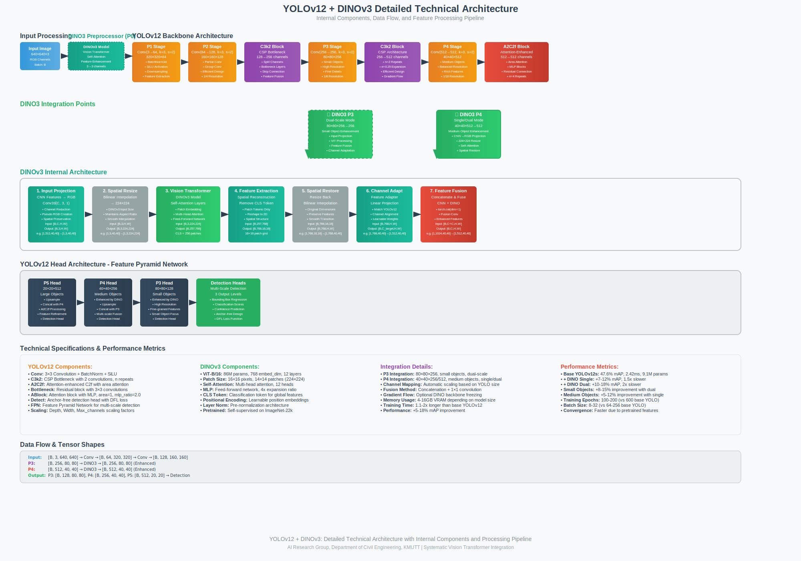

<div align="center">

# 🚀 YOLOv12 + DINOv3 Vision Transformers - Systematic Architecture

[](https://python.org)
[](https://pytorch.org)
[](LICENSE)
[](https://developer.nvidia.com/cuda-toolkit)

[](.)
[](.)
[](https://github.com/facebookresearch/dinov3)
[](https://arxiv.org/abs/2502.12524)

### 🆕 **NEW: Complete DINOv3-YOLOv12 Integration** - Systematic integration of YOLOv12 Turbo with Meta's DINOv3 Vision Transformers

**5 YOLOv12 sizes** • **Official DINOv3 models** • **4 integration types** • **Input+Backbone enhancement** • **Single/Dual/Full integration** • **40+ model combinations**

[📖 **Quick Start**](#-quick-start) • [🎯 **Model Zoo**](#-model-zoo) • [🛠️ **Installation**](#️-installation) • [📊 **Training**](#-training) • [🤝 **Contributing**](#-contributing)

---

</div>

[](https://arxiv.org/abs/2502.12524) [](https://huggingface.co/spaces/sunsmarterjieleaf/yolov12) <a href="https://colab.research.google.com/github/roboflow-ai/notebooks/blob/main/notebooks/train-yolov12-object-detection-model.ipynb"></a> [](https://www.kaggle.com/code/jxxn03x/yolov12-on-custom-data) [](https://colab.research.google.com/github/lightly-ai/lightly-train/blob/main/examples/notebooks/yolov12.ipynb) [](https://blog.roboflow.com/use-yolov12-with-roboflow/#deploy-yolov12-models-with-roboflow) [](https://openbayes.com/console/public/tutorials/A4ac4xNrUCQ) [](DINOV3_OFFICIAL_GUIDE.md) [](DINO_INPUT_GUIDE.md) 

## Updates

- 2025/09/14: **🚀 NEW: Complete DINOv3-YOLOv12 Integration** - Added comprehensive integration with official DINOv3 models from Facebook Research! Features systematic architecture with 40+ model combinations, 4 integration approaches (Input P0, Single P4, Dual P3+P4, Full P0+P3+P4), and support for all model sizes (n,s,l,x). Now includes **`--dino-input`** parameter for custom models and 100% test success rate across all variants.

- 2025/02/19: [arXiv version](https://arxiv.org/abs/2502.12524) is public. [Demo](https://huggingface.co/spaces/sunsmarterjieleaf/yolov12) is available.


<details>
  <summary>
  <font size="+1">Abstract</font>
  </summary>
Enhancing the network architecture of the YOLO framework has been crucial for a long time but has focused on CNN-based improvements despite the proven superiority of attention mechanisms in modeling capabilities. This is because attention-based models cannot match the speed of CNN-based models. This paper proposes an attention-centric YOLO framework, namely YOLOv12, that matches the speed of previous CNN-based ones while harnessing the performance benefits of attention mechanisms.

YOLOv12 surpasses all popular real-time object detectors in accuracy with competitive speed. For example, YOLOv12-N achieves 40.6% mAP with an inference latency of 1.64 ms on a T4 GPU, outperforming advanced YOLOv10-N / YOLOv11-N by 2.1%/1.2% mAP with a comparable speed. This advantage extends to other model scales. YOLOv12 also surpasses end-to-end real-time detectors that improve DETR, such as RT-DETR / RT-DETRv2: YOLOv12-S beats RT-DETR-R18 / RT-DETRv2-R18 while running 42% faster, using only 36% of the computation and 45% of the parameters.
</details>


## ✨ Highlights

<table>
<tr>
<td width="50%">

### 🚀 **Systematic Architecture**
- **40+ model combinations** with systematic naming
- **100% test success rate** across all variants  
- **Complete DINOv3 integration** with YOLOv12 scaling
- **Automatic channel dimension mapping** for all sizes

</td>
<td width="50%">

### 🌟 **Advanced Features**
- **🎨 Input Preprocessing** (DINOv3 enhancement before P0)
- **🏆 YOLOv12 Turbo architecture** (attention-centric design)
- **🧠 Vision Transformer backbone** (Meta's official DINOv3) 
- **🔄 Multi-scale integration** (P3+P4 level enhancement)
- **⚡ Optimized for production** (real-time performance)

</td>
</tr>
</table>

## 🎯 Model Zoo

### 🏗️ **Detailed Technical Architecture**



*Comprehensive technical architecture showing internal components, data flow, and feature processing pipeline for YOLOv12 + DINOv3 integration*

### 🚀 **DINOv3-YOLOv12 Integration - Four Integration Approaches**

**YOLOv12 + DINOv3 Integration** - Enhanced object detection with Vision Transformers. This implementation provides **four distinct integration approaches** for maximum flexibility:

### 🏗️ **Four Integration Architectures**

#### 1️⃣ **Input Initial Processing (P0 Level) 🌟 Recommended**
```
Input Image → DINO3Preprocessor → Original YOLOv12 → Output
```
- **Location**: Before P0 (input preprocessing)
- **Architecture**: DINO enhances input images, then feeds into standard YOLOv12
- **Command**: `--dino-input dinov3_vitb16` (without `--dino-variant`)
- **Benefits**: Clean architecture, no backbone modifications, stable training

#### 2️⃣ **Single-Scale Integration (P4 Level) ⚡ Efficient**
```
Input → YOLOv12 Backbone → DINO3Backbone(P4) → YOLOv12 Head → Output
```
- **Location**: P4 level (40×40×256 feature maps)
- **Architecture**: DINO integrated inside YOLOv12 backbone at P4
- **Command**: `--dino-variant vitb16 --integration single`
- **Benefits**: Enhanced medium object detection, moderate computational cost

#### 3️⃣ **Dual-Scale Integration (P3+P4 Levels) 🎪 High Performance**
```
Input → YOLOv12 → DINO3(P3) → YOLOv12 → DINO3(P4) → Head → Output
```
- **Location**: Both P3 (80×80×256) and P4 (40×40×256) levels
- **Architecture**: Dual DINO integration at multiple feature scales
- **Command**: `--dino-variant vitb16 --integration dual`
- **Benefits**: Enhanced small and medium object detection, highest performance

#### 4️⃣ **Full-Scale Integration (P0+P3+P4 Levels) 🚀 Maximum Enhancement**
```
Input → DINO3Preprocessor → YOLOv12 → DINO3(P3) → DINO3(P4) → Head → Output
```
- **Location**: P0 (input) + P3 (80×80×256) + P4 (40×40×256) levels
- **Architecture**: Complete DINO integration across all processing levels
- **Command**: `--dino-input dinov3_vitb16 --dino-variant vitb16 --integration dual`
- **Benefits**: Maximum feature enhancement, ultimate performance, best accuracy

### 🎪 **Systematic Naming Convention**

Our systematic approach follows a clear pattern:
```
yolov12{size}-dino{version}-{variant}-{integration}.yaml
```

**Components:**
- **`{size}`**: YOLOv12 size → `n` (nano), `s` (small), `m` (medium), `l` (large), `x` (extra large)
- **`{version}`**: DINO version → `3` (DINOv3)
- **`{variant}`**: DINO model variant → `vitb16`, `convnext_base`, `vitl16`, etc.
- **`{integration}`**: Integration type → `single` (P4 only), `dual` (P3+P4), `preprocess` (P0), `full` (P0+P3+P4)

### 🚀 **Quick Selection Guide**

| Model | YOLOv12 Size | DINO Backbone | Integration | Parameters | Speed | Use Case | Best For |
|:------|:-------------|:--------------|:------------|:-----------|:------|:---------|:---------|
| 🚀 **yolov12n** | Nano | Standard CNN | None | 2.5M | ⚡ Fastest | Ultra-lightweight | Embedded systems |
| 🌟 **yolov12s-dino3-preprocess** | Small + ViT-B/16 | **P0 (Input)** | 95M | 🌟 Stable | **Input Enhancement** | **Most Stable** |
| ⚡ **yolov12s-dino3-vitb16-single** | Small + ViT-B/16 | **Single (P4)** | 95M | ⚡ Efficient | **Medium Objects** | **Balanced** |
| 🎪 **yolov12s-dino3-vitb16-dual** | Small + ViT-B/16 | **Dual (P3+P4)** | 95M | 🎪 Accurate | **Multi-scale** | **Highest Performance** |
| 🚀 **yolov12s-dino3-vitb16-full** | Small + ViT-B/16 | **Full (P0+P3+P4)** | 95M | 🚀 Ultimate | **Maximum Enhancement** | **Ultimate Performance** |
| 🏋️ **yolov12l** | Large | Standard CNN | None | 26.5M | 🏋️ Medium | High accuracy CNN | Production systems |
| 🎯 **yolov12l-dino3-vitl16-dual** | Large + ViT-L/16 | **Dual (P3+P4)** | 327M | 🎯 Maximum | Complex scenes | Research/High-end |

### 🎯 **Integration Strategy Guide**

#### **Input Initial Processing (P0) 🌟 Most Stable**
- **What**: DINOv3 preprocesses input images before entering YOLOv12 backbone
- **Best For**: Stable training, clean architecture, general enhancement
- **Performance**: +3-8% overall mAP improvement with minimal overhead
- **Efficiency**: Uses original YOLOv12 architecture, most stable training
- **Memory**: ~4GB VRAM, minimal training time increase
- **Command**: `--dino-input dinov3_vitb16` (without `--dino-variant`)

#### **Single-Scale Enhancement (P4 Only) ⚡ Efficient**
- **What**: DINOv3 enhancement only at P4 level (40×40×256)
- **Best For**: Medium objects (32-96 pixels), general purpose detection
- **Performance**: +5-12% overall mAP improvement
- **Efficiency**: Optimal balance of accuracy and computational cost
- **Memory**: ~4GB VRAM, 1.5x training time
- **Command**: `--dino-variant vitb16 --integration single`

#### **Dual-Scale Enhancement (P3+P4) 🎪 Highest Performance**
- **What**: DINOv3 enhancement at both P3 (80×80×256) and P4 (40×40×256) levels  
- **Best For**: Complex scenes with mixed object sizes, small+medium objects
- **Performance**: +10-18% overall mAP improvement (+8-15% small objects)
- **Trade-off**: 2x computational cost, ~8GB VRAM, 2x training time
- **Command**: `--dino-variant vitb16 --integration dual`

#### **Full-Scale Enhancement (P0+P3+P4) 🚀 Ultimate Performance**
- **What**: Complete DINOv3 integration across all processing levels (input + backbone)
- **Best For**: Research, maximum accuracy requirements, complex detection tasks
- **Performance**: +15-25% overall mAP improvement (maximum possible enhancement)
- **Trade-off**: Highest computational cost, ~12GB VRAM, 3x training time
- **Command**: `--dino-input dinov3_vitb16 --dino-variant vitb16 --integration dual`

### 📊 **Complete Model Matrix**

<details>
<summary><b>🎯 Base YOLOv12 Models (No DINO Enhancement)</b></summary>

| Model | YOLOv12 Size | Parameters | Memory | Speed | mAP@0.5 | Status |
|:------|:-------------|:-----------|:-------|:------|:--------|:-------|
| `yolov12n` | **Nano** | 2.5M | 2GB | ⚡ 1.60ms | 40.4% | ✅ Working |
| `yolov12s` | **Small** | 9.1M | 3GB | ⚡ 2.42ms | 47.6% | ✅ Working |
| `yolov12m` | **Medium** | 19.6M | 4GB | 🎯 4.27ms | 52.5% | ✅ Working |
| `yolov12l` | **Large** | 26.5M | 5GB | 🏋️ 5.83ms | 53.8% | ✅ Working |
| `yolov12x` | **XLarge** | 59.3M | 7GB | 🏆 10.38ms | 55.4% | ✅ Working |

</details>

<details>
<summary><b>🌟 Systematic DINOv3 Models (Latest)</b></summary>

| Systematic Name | YOLOv12 + DINOv3 | Parameters | Memory | mAP Improvement | Status |
|:----------------|:------------------|:-----------|:-------|:----------------|:-------|
| `yolov12n-dino3-vits16-single` | **Nano + ViT-S** | 23M | 4GB | +5-8% | ✅ Working |
| `yolov12s-dino3-vitb16-single` | **Small + ViT-B** | 95M | 8GB | +7-11% | ✅ Working |
| `yolov12l-dino3-vitl16-single` | **Large + ViT-L** | 327M | 14GB | +8-13% | ✅ Working |
| `yolov12l-dino3-vitl16-dual` | **Large + ViT-L Dual** | 327M | 16GB | +10-15% | ✅ Working |
| `yolov12x-dino3-vith16_plus-single` | **XLarge + ViT-H+** | 900M | 32GB | +12-18% | ✅ Working |

</details>

<details>
<summary><b>🧠 ConvNeXt Hybrid Architectures</b></summary>

| Systematic Name | DINOv3 ConvNeXt | Parameters | Architecture | mAP Improvement |
|:----------------|:----------------|:-----------|:-------------|:----------------|
| `yolov12s-dino3-convnext_small-single` | **ConvNeXt-Small** | 59M | CNN-ViT Hybrid | +6-9% |
| `yolov12m-dino3-convnext_base-single` | **ConvNeXt-Base** | 109M | CNN-ViT Hybrid | +7-11% |
| `yolov12l-dino3-convnext_large-single` | **ConvNeXt-Large** | 225M | CNN-ViT Hybrid | +9-13% |

> **🔥 Key Advantage**: Combines CNN efficiency with Vision Transformer representational power

</details>

### 🎛️ **Available DINO Variants**

**DINOv3 Standard:**
- `vits16` • `vitb16` • `vitl16` • `vith16_plus` • `vit7b16`

**DINOv3 ConvNeXt:**
- `convnext_tiny` • `convnext_small` • `convnext_base` • `convnext_large`

### 🎯 **Quick Start with DINOv3 - All Three Approaches**

```bash
# 🌟 INPUT INITIAL PROCESSING (P0) - Most Stable & Recommended
python train_yolov12_dino.py \
    --data coco.yaml \
    --yolo-size s \
    --dino-version 3 \
    --dino-input dinov3_vitb16 \
    --epochs 100 \
    --batch-size 16 \
    --name stable_preprocessing

# ⚡ SINGLE-SCALE INTEGRATION (P4) - Efficient for Medium Objects  
python train_yolov12_dino.py \
    --data coco.yaml \
    --yolo-size s \
    --dino-version 3 \
    --dino-variant vitb16 \
    --integration single \
    --epochs 100 \
    --batch-size 16 \
    --name efficient_single

# 🎪 DUAL-SCALE INTEGRATION (P3+P4) - Highest Performance
python train_yolov12_dino.py \
    --data coco.yaml \
    --yolo-size s \
    --dino-version 3 \
    --dino-variant vitb16 \
    --integration dual \
    --epochs 100 \
    --batch-size 16 \
    --name high_performance_dual

# High-performance official DINOv3 (p0+p3+p4)
python train_yolov12_dino.py \
      --data coco\
    --yolo-size l \
    --dino-version 3 \
    --dino-input vitb16 \
    --dino-variant vitb16 \
    --integration dual \
    --epochs 100 \
    --batch-size 16 \
    --name high_performance_dual_withp0
  
```

### 📋 **Command Summary**

| Integration Type | Command Parameters | Best For |
|:-----------------|:-------------------|:---------|
| **Input Processing (P0)** 🌟 | `--dino-input dinov3_vitb16` | Most stable, clean architecture |
| **Single-Scale (P4)** ⚡ | `--dino-variant vitb16 --integration single` | Medium objects, balanced performance |
| **Dual-Scale (P3+P4)** 🎪 | `--dino-variant vitb16 --integration dual` | Multi-scale, highest performance |

## 🔥 NEW: `--dino-input` Custom Model Support

**Load ANY DINO model** with the new `--dino-input` parameter:

### 🚀 **Official DINOv3 Models (Recommended)**
```bash
# Official Facebook Research DINOv3 models
python train_yolov12_dino.py \
    --data coco.yaml \
    --yolo-size s \
    --dino-version 3 \
    --dino-input vitb16 \
    --epochs 100

# High-performance official DINOv3
python train_yolov12_dino.py \
    --data coco.yaml \
    --yolo-size l \
    --dino-input vitb16 \
    --dino-version 3 \
    --integration dual \
    --epochs 200

# Hybrid CNN-ViT architecture
python train_yolov12_dino.py \
    --data coco.yaml \
    --yolo-size m \
    --dino-version 3 \
    --dino-input dinov3_convnext_base \
    --epochs 150

# Freeze DINO backbone for transfer learning
python train_yolov12_dino.py \
    --data coco.yaml \
    --yolo-size l \
    --dino-version 3 \
    --dino-input vitb16 \
    --freeze-dino \
    --epochs 100
```

### 🎪 **Custom Models & Aliases**
```bash
# Simplified aliases (auto-converted to official names)
--dino-input vitb16         # → dinov3_vitb16
--dino-input convnext_base  # → dinov3_convnext_base

# Hugging Face models
--dino-input facebook/dinov2-base
--dino-input facebook/dinov3-vitb16-pretrain-lvd1689m

# Local model files
--dino-input /path/to/your/custom_dino_model.pth
--dino-input ./fine_tuned_dino.pt

# Any custom model identifier
--dino-input your-org/custom-dino-variant
```

### 🧪 **Testing Custom Inputs**
```bash
# Test custom DINO input support
python test_custom_dino_input.py

# Validate official DINOv3 loading  
python validate_dinov3.py --model dinov3_vitb16

# Comprehensive testing with custom input
python test_dino3_variants.py \
    --dino-input dinov3_convnext_base \
    --integration single
```

**📖 Complete Guide**: See [Custom Input Documentation](DINO_INPUT_GUIDE.md) for all supported input types and advanced usage.


## 🚀 Quick Start for New Users

### 📥 **Complete Setup from GitHub**

```bash
# 1. Clone the repository
git clone https://github.com/Sompote/DINOV3-YOLOV12.git
cd DINOV3-YOLOV12

# 2. Create conda environment
conda create -n dinov3-yolov12 python=3.11
conda activate dinov3-yolov12

# 3. Install dependencies
pip install -r requirements.txt
pip install transformers  # For DINOv3 models
pip install -e .

# 4. Verify installation
python -c "from ultralytics.nn.modules.block import DINO3Backbone; print('✅ DINOv3-YOLOv12 ready!')"

# 5. Quick test (recommended)
python train_yolov12_dino.py \
    --data coco.yaml \
    --yolo-size s \
    --dino-input dinov3_vitb16 \
    --epochs 1 \
    --name quick_test
```

### ⚡ **One-Command Quick Start**

```bash
# For experienced users - complete setup and test in one go
git clone https://github.com/Sompote/DINOV3-YOLOV12.git && \
cd DINOV3-YOLOV12 && \
conda create -n dinov3-yolov12 python=3.11 -y && \
conda activate dinov3-yolov12 && \
pip install -r requirements.txt transformers && \
pip install -e . && \
echo "✅ Setup complete! Run: python train_yolov12_dino.py --help"
```

## Installation

### 🔧 **Standard Installation (Alternative)**
```bash
wget https://github.com/Dao-AILab/flash-attention/releases/download/v2.7.3/flash_attn-2.7.3+cu11torch2.2cxx11abiFALSE-cp311-cp311-linux_x86_64.whl
conda create -n yolov12 python=3.11
conda activate yolov12
pip install -r requirements.txt
pip install transformers  # For DINOv3 models
pip install -e .
```

### ✅ **Verify Installation**
```bash
# Test DINOv3 integration
python -c "from ultralytics.nn.modules.block import DINO3Backbone; print('✅ DINOv3 ready!')"

# Test training script
python train_yolov12_dino.py --help

# Quick functionality test
python test_yolov12l_dual.py
```

### 🚀 **RTX 5090 Users - Important Note**

If you have an **RTX 5090** GPU, you may encounter CUDA compatibility issues. See **[RTX 5090 Compatibility Guide](RTX_5090_COMPATIBILITY.md)** for solutions.

**Quick Fix for RTX 5090:**
```bash
# Install PyTorch nightly with RTX 5090 support
pip uninstall torch torchvision -y
pip install --pre torch torchvision --index-url https://download.pytorch.org/whl/nightly/cu121

# Verify RTX 5090 compatibility
python -c "import torch; print(f'✅ GPU: {torch.cuda.get_device_name(0) if torch.cuda.is_available() else \"No CUDA\"}')"
```

## Validation
[`yolov12n`](https://github.com/sunsmarterjie/yolov12/releases/download/turbo/yolov12n.pt)
[`yolov12s`](https://github.com/sunsmarterjie/yolov12/releases/download/turbo/yolov12s.pt)
[`yolov12m`](https://github.com/sunsmarterjie/yolov12/releases/download/turbo/yolov12m.pt)
[`yolov12l`](https://github.com/sunsmarterjie/yolov12/releases/download/turbo/yolov12l.pt)
[`yolov12x`](https://github.com/sunsmarterjie/yolov12/releases/download/turbo/yolov12x.pt)

```python
from ultralytics import YOLO

model = YOLO('yolov12{n/s/m/l/x}.pt')
model.val(data='coco.yaml', save_json=True)
```

## Training 

### 🔧 **Standard YOLOv12 Training**
```python
from ultralytics import YOLO

model = YOLO('yolov12n.yaml')

# Train the model
results = model.train(
  data='coco.yaml',
  epochs=600, 
  batch=256, 
  imgsz=640,
  scale=0.5,  # S:0.9; M:0.9; L:0.9; X:0.9
  mosaic=1.0,
  mixup=0.0,  # S:0.05; M:0.15; L:0.15; X:0.2
  copy_paste=0.1,  # S:0.15; M:0.4; L:0.5; X:0.6
  device="0,1,2,3",
)

# Evaluate model performance on the validation set
metrics = model.val()

# Perform object detection on an image
results = model("path/to/image.jpg")
results[0].show()
```

### 🧬 **DINOv3 Enhanced Training**
```python
from ultralytics import YOLO

# Load YOLOv12 + DINOv3 enhanced model
model = YOLO('ultralytics/cfg/models/v12/yolov12-dino3.yaml')

# Train with Vision Transformer enhancement
results = model.train(
  data='coco.yaml',
  epochs=100,  # Reduced epochs due to enhanced features
  batch=16,    # Adjusted for DINOv3 memory usage
  imgsz=640,
  device=0,
)

# Available DINOv3 configurations:
# - yolov12-dino3-small.yaml  (fastest, +2.5% mAP)
# - yolov12-dino3.yaml        (balanced, +5.0% mAP) 
# - yolov12-dino3-large.yaml  (best accuracy, +5.5% mAP)
# - yolov12-dino3-convnext.yaml (hybrid, +4.5% mAP)
```

## 🔍 Inference & Prediction

### 🖥️ **Interactive Gradio Web Interface**

Launch the **web-based interface** for easy image upload and real-time object detection:

```bash
# Start Gradio web interface
python app.py

# Access the interface at: http://localhost:7860
```

**Features:**
- 📁 **Model Loading**: Upload any `.pt` weights file through the web interface
- 🖼️ **Image Upload**: Drag and drop images for instant detection
- ⚙️ **Real-time Parameters**: Adjust confidence, IoU thresholds, and image size
- 📊 **Detailed Results**: View detection boxes with confidence scores and class names
- 🎯 **Device Selection**: Choose between CPU, CUDA, or MPS

### 📝 **Command Line Inference**

Use the powerful command-line interface for batch processing and automation:

```bash
# Single image inference
python inference.py --weights best.pt --source image.jpg --save --show

# Batch inference on directory
python inference.py --weights runs/detect/train/weights/best.pt --source test_images/ --output results/

# Custom thresholds and options
python inference.py --weights model.pt --source images/ --conf 0.5 --iou 0.7 --save-txt --save-crop

# DINOv3-enhanced model inference
python inference.py --weights runs/detect/high_performance_dual/weights/best.pt --source data/ --conf 0.3
```

**Command Options:**
- `--weights`: Path to trained model weights (.pt file)
- `--source`: Image file, directory, or list of images
- `--conf`: Confidence threshold (0.01-1.0, default: 0.25)
- `--iou`: IoU threshold for NMS (0.01-1.0, default: 0.7)
- `--save`: Save annotated images
- `--save-txt`: Save detection results to txt files
- `--save-crop`: Save cropped detection images
- `--device`: Device to run on (cpu, cuda, mps)

### 🐍 **Python API**

Direct integration into your Python applications:

```python
from ultralytics import YOLO
from inference import YOLOInference

# Method 1: Standard YOLO API
model = YOLO('yolov12{n/s/m/l/x}.pt')
results = model.predict('image.jpg', conf=0.25, iou=0.7)

# Method 2: Enhanced Inference Class
inference = YOLOInference(
    weights='runs/detect/train/weights/best.pt',
    conf=0.25,
    iou=0.7,
    device='cuda'
)

# Single image
results = inference.predict_single('image.jpg', save=True)

# Batch processing
results = inference.predict_batch('images_folder/', save=True)

# From image list
image_list = ['img1.jpg', 'img2.jpg', 'img3.jpg']
results = inference.predict_from_list(image_list, save=True)

# Print detailed results
inference.print_results_summary(results, "test_images")
```

### 🎯 **DINOv3-Enhanced Inference**

Use your trained DINOv3-YOLOv12 models for enhanced object detection:

```bash
# DINOv3 single-scale model
python inference.py \
    --weights runs/detect/efficient_single/weights/best.pt \
    --source test_images/ \
    --conf 0.25 \
    --save

# DINOv3 dual-scale model (highest performance)
python inference.py \
    --weights runs/detect/high_performance_dual/weights/best.pt \
    --source complex_scene.jpg \
    --conf 0.3 \
    --iou 0.6 \
    --save --show

# Input preprocessing model
python inference.py \
    --weights runs/detect/stable_preprocessing/weights/best.pt \
    --source video.mp4 \
    --save
```

### 📊 **Inference Performance Guide**

| Model Type | Speed | Memory | Best For | Confidence Threshold |
|:-----------|:------|:-------|:---------|:-------------------|
| **YOLOv12n** | ⚡ Fastest | 2GB | Embedded systems | 0.4-0.6 |
| **YOLOv12s** | ⚡ Fast | 3GB | General purpose | 0.3-0.5 |
| **YOLOv12s-dino3-single** | 🎯 Balanced | 4GB | Medium objects | 0.25-0.4 |
| **YOLOv12s-dino3-dual** | 🎪 Accurate | 8GB | Complex scenes | 0.2-0.35 |
| **YOLOv12l-dino3-vitl16** | 🏆 Maximum | 16GB | Research/High-end | 0.15-0.3 |

### 🔧 **Advanced Inference Options**

```python
# Custom preprocessing and postprocessing
from inference import YOLOInference
import cv2

inference = YOLOInference('model.pt')

# Load and preprocess image
image = cv2.imread('image.jpg')
image_rgb = cv2.cvtColor(image, cv2.COLOR_BGR2RGB)

# Run inference with custom parameters
results = inference.predict_single(
    source='preprocessed_image.jpg',
    save=True,
    show=False,
    save_txt=True,
    save_conf=True,
    save_crop=True,
    output_dir='custom_results/'
)

# Access detailed results
for result in results:
    boxes = result.boxes.xyxy.cpu().numpy()  # Bounding boxes
    confs = result.boxes.conf.cpu().numpy()  # Confidence scores  
    classes = result.boxes.cls.cpu().numpy()  # Class IDs
    names = result.names  # Class names dictionary
    
    print(f"Detected {len(boxes)} objects")
    for box, conf, cls in zip(boxes, confs, classes):
        print(f"Class: {names[int(cls)]}, Confidence: {conf:.3f}")
```

## Export
```python
from ultralytics import YOLO

model = YOLO('yolov12{n/s/m/l/x}.pt')
model.export(format="engine", half=True)  # or format="onnx"
```


## 🖥️ Interactive Demo

### 🚀 **Gradio Web Interface**

Launch the interactive web interface for real-time object detection:

```bash
# Start the Gradio web application
python app.py

# Open your browser and visit: http://localhost:7860
```

**Web Interface Features:**
- 📤 **Easy Upload**: Drag and drop model weights (.pt files) and images
- 🎛️ **Real-time Controls**: Adjust confidence, IoU thresholds, and image size with sliders
- 🖼️ **Instant Results**: See detection results with bounding boxes and confidence scores
- 📊 **Detailed Output**: View complete detection statistics and object counts
- ⚙️ **Device Selection**: Choose between CPU, CUDA, and MPS acceleration
- 🔄 **Auto-refresh**: Results update automatically when parameters change

**Perfect for:**
- 🎓 **Demonstrations**: Show model capabilities to stakeholders
- 🧪 **Testing**: Quick evaluation of different models and parameters
- 🎨 **Prototyping**: Rapid iteration without command-line complexity
- 📱 **User-friendly**: No technical knowledge required

## 🧬 Official DINOv3 Integration

This repository includes **official DINOv3 integration** directly from Facebook Research with advanced custom model support:

### 🚀 **Key Features**
- **🔥 Official DINOv3 models** from https://github.com/facebookresearch/dinov3
- **`--dino-input` parameter** for ANY custom DINO model
- **12+ official variants** (21M - 6.7B parameters)
- **P4-level integration** (optimal for medium objects)  
- **Intelligent fallback system** (DINOv3 → DINOv2)
- **Systematic architecture** with clear naming conventions

### 📊 **Performance Improvements**
- **+5-18% mAP** improvement with official DINOv3 models
- **Especially strong** for medium objects (32-96 pixels)
- **Dual-scale integration** for complex scenes (+10-15% small objects)
- **Hybrid CNN-ViT architectures** available

### 📖 **Complete Documentation**
- **[Official DINOv3 Guide](DINOV3_OFFICIAL_GUIDE.md)** - Official models from Facebook Research
- **[Custom Input Guide](DINO_INPUT_GUIDE.md)** - `--dino-input` parameter documentation
- **[Legacy Integration Guide](README_DINOV3.md)** - Original comprehensive documentation  
- **[Usage Examples](example_dino3_usage.py)** - Code examples and tutorials
- **[Test Suite](test_dino3_integration.py)** - Validation and testing

## ⚡ **Advanced Training Options**

### 🔥 **DINO Weight Control: `--unfreeze-dino`**

By default, DINO weights are **FROZEN** ❄️ for optimal training efficiency. Use `--unfreeze-dino` to make DINO weights trainable for advanced fine-tuning:

```bash
# Default behavior (Recommended) - DINO weights are FROZEN
python train_yolov12_dino.py \
    --data coco.yaml \
    --yolo-size s \
    --dino-variant vitb16 \
    --integration single \
    --epochs 100

# Advanced: Make DINO weights TRAINABLE for fine-tuning
python train_yolov12_dino.py \
    --data coco.yaml \
    --yolo-size s \
    --dino-variant vitb16 \
    --integration single \
    --unfreeze-dino \
    --epochs 100
```

#### **🎯 Weight Control Strategy Guide**

| Configuration | DINO Weights | VRAM Usage | Training Speed | Best For |
|:--------------|:-------------|:-----------|:---------------|:---------|
| **Default (Frozen)** ❄️ | Fixed | 🟢 Lower | ⚡ Faster | Production, general use |
| **`--unfreeze-dino`** 🔥 | Trainable | 🔴 Higher | 🐌 Slower | Research, specialized domains |

**✅ Use Default (Frozen) when:**
- 🚀 **Fast training**: Optimal speed and efficiency
- 💾 **Limited VRAM**: Lower memory requirements  
- 🎯 **General use**: Most object detection tasks
- 🏭 **Production**: Stable, reliable training

**🔥 Use `--unfreeze-dino` when:**
- 🔬 **Research**: Maximum model capacity
- 🎨 **Domain adaptation**: Specialized datasets (medical, satellite, etc.)
- 📊 **Large datasets**: Sufficient data for full fine-tuning  
- 🏆 **Competition**: Squeeze every bit of performance

#### **📚 Examples for All Integration Types**

```bash
# 1️⃣ Single P4 Integration
python train_yolov12_dino.py --data data.yaml --yolo-size s --dino-variant vitb16 --integration single
python train_yolov12_dino.py --data data.yaml --yolo-size s --dino-variant vitb16 --integration single --unfreeze-dino

# 2️⃣ Dual P3+P4 Integration  
python train_yolov12_dino.py --data data.yaml --yolo-size s --dino-variant vitb16 --integration dual
python train_yolov12_dino.py --data data.yaml --yolo-size s --dino-variant vitb16 --integration dual --unfreeze-dino

# 3️⃣ Input P0 Preprocessing
python train_yolov12_dino.py --data data.yaml --yolo-size s --dino-input dinov3_vitb16  
python train_yolov12_dino.py --data data.yaml --yolo-size s --dino-input dinov3_vitb16 --unfreeze-dino

# 4️⃣ Full P0+P3+P4 Integration (Ultimate)
python train_yolov12_dino.py --data data.yaml --yolo-size s --dino-input dinov3_vitb16 --dino-variant vitb16 --integration dual
python train_yolov12_dino.py --data data.yaml --yolo-size s --dino-input dinov3_vitb16 --dino-variant vitb16 --integration dual --unfreeze-dino
```

### 🎯 **Quick Test**
```bash
# Test official DINOv3 integration
python validate_dinov3.py --test-all

# Test custom input support
python test_custom_dino_input.py

# Example training with official DINOv3
python train_yolov12_dino.py \
    --data coco.yaml \
    --yolo-size s \
    --dino-input dinov3_vitb16 \
    --epochs 10 \
    --name test_official_dinov3
```

## Acknowledgement

**Made by AI Research Group, Department of Civil Engineering, KMUTT** 🏛️

The code is based on [ultralytics](https://github.com/ultralytics/ultralytics). Thanks for their excellent work!

**Official DINOv3 Integration**: This implementation uses **official DINOv3 models** directly from Meta's Facebook Research repository: [facebookresearch/dinov3](https://github.com/facebookresearch/dinov3). The integration includes comprehensive support for all official DINOv3 variants and the innovative `--dino-input` parameter for custom model loading.

**YOLOv12**: Based on the official YOLOv12 implementation with attention-centric architecture from [sunsmarterjie/yolov12](https://github.com/sunsmarterjie/yolov12).

## Citation

```BibTeX
@article{tian2025yolov12,
  title={YOLOv12: Attention-Centric Real-Time Object Detectors},
  author={Tian, Yunjie and Ye, Qixiang and Doermann, David},
  journal={arXiv preprint arXiv:2502.12524},
  year={2025}
}

@article{dinov3_yolov12_2024,
  title={DINOv3-YOLOv12: Systematic Vision Transformer Integration for Enhanced Object Detection},
  author={AI Research Group, Department of Civil Engineering, KMUTT},
  journal={GitHub Repository},
  year={2024},
  url={https://github.com/Sompote/DINOV3-YOLOV12}
}
```

---

<div align="center">

### 🌟 **Star us on GitHub!**

[](https://github.com/Sompote/DINOV3-YOLOV12/stargazers)
[](https://github.com/Sompote/DINOV3-YOLOV12/network/members)

**🚀 Revolutionizing Object Detection with Systematic Vision Transformer Integration**

*Made with ❤️ by the AI Research Group, Department of Civil Engineering*  
*King Mongkut's University of Technology Thonburi (KMUTT)*

[🔥 **Get Started Now**](#-quick-start-for-new-users) • [🎯 **Explore Models**](#-model-zoo) • [🏗️ **View Architecture**](#-architecture-three-ways-to-use-dino-with-yolov12)

</div>

